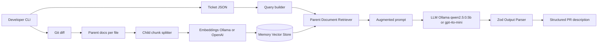

# Technical Design — PR Description RAG (Capstone JS)

## 1. Problem statement

**Pain:** Reviewers need context linking Jira acceptance criteria to actual code changes. Authors often ship thin PR descriptions under time pressure.

**User:** Backend developer opening a PR after implementing a ticket.

**Impact:** Slower reviews, missed AC coverage, rework.

**ROI:** ~$0.03–0.06 per draft (gpt-4o-mini + embeddings). Break-even vs 15 min manual writing at typical engineer cost in under 10 PRs/month.

## 2. Solution overview

A CLI prototype ingests:

1. **Ticket JSON** — title, description, acceptance criteria
2. **Unified diff** — split per file into parent documents

On generate, the system embeds a query from the ticket, retrieves relevant diff hunks via **Parent Document Retrieval**, and runs an **LCEL** chain with **structured output** (Zod).

**Runtime modes:**

- **Local (default):** Docker Compose + Ollama (`qwen2.5:0.5b`, `nomic-embed-text`) — no API keys.
- **Cloud (optional):** OpenAI when `LLM_PROVIDER=openai`.

## 3. Architecture diagram

## 4. Key decisions

| Decision | Choice | Why |
|----------|--------|-----|
| LLM (local) | qwen2.5:0.5b via Ollama | Tiny, runs on laptop CPU/GPU, zero cost |
| Embeddings (local) | nomic-embed-text | Small, good quality for RAG prototypes |
| LLM (cloud) | gpt-4o-mini | Optional higher-quality path |
| Deployment | Docker Compose | Reproducible local stack for Moodle demo |
| Orchestration | LCEL | Modular, composable, course standard |
| Retrieval | Parent Document Retrieval | Small chunks for search, full hunks for context |
| Output | Zod schema | Prevents vague prose; maps AC explicitly |

## 5. Advanced optimization — Parent Document Retrieval

Child chunks (~400 chars) are embedded for semantic search. When a child matches, the **full parent diff hunk** (entire file patch) is returned. This improves context quality without embedding huge documents.

## 6. Iteration evidence

| Version | Issue | Fix |
|---------|-------|-----|
| v1 | Unstructured text, high temperature | Structured Zod output, temp 0.1 |
| v1 | Generic summary | Explicit AC mapping in prompt |
| v2 | N/A | Prompt injection guard in system message |

Artifacts: `evidence/iteration-v1-raw.txt`, `evidence/iteration-v2-structured.json`.

## 7. Trade-offs & production path

**Latency vs accuracy:** Retrieval adds ~200–500 ms; still faster than human drafting.

**Cost vs quality:** mini model may miss nuance on huge diffs; escalation path to gpt-4o for large changes.

**Security:** Treat diff as untrusted input; never execute embedded instructions.

**Zero results:** Return ticket-only draft and flag missing code context in `risks`.

**Scale:** Replace in-memory store with Pinecone/pgvector; add API layer + auth; LangSmith for production monitoring.

## 8. Evaluation mapping (rubric)

| Criterion | How addressed |
|-----------|----------------|
| Architecture (20%) | Modular ingest / retrieval / chains |
| Implementation (20%) | Working CLI, sample data, edge-case prompts |
| Iteration (15%) | v1 vs v2 artifacts |
| Prod-readiness (10%) | Sections 7 + LangSmith hooks |
| Problem & logic (35%) | Real SDLC pain + ROI |
